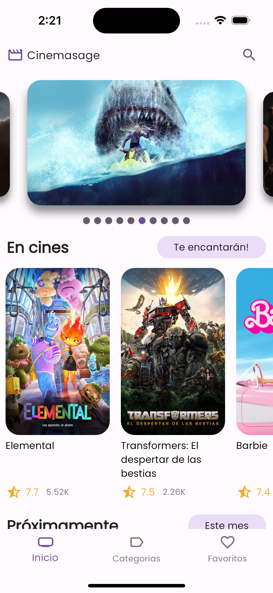
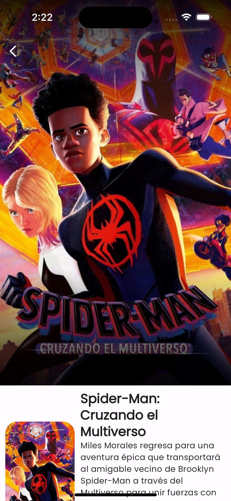
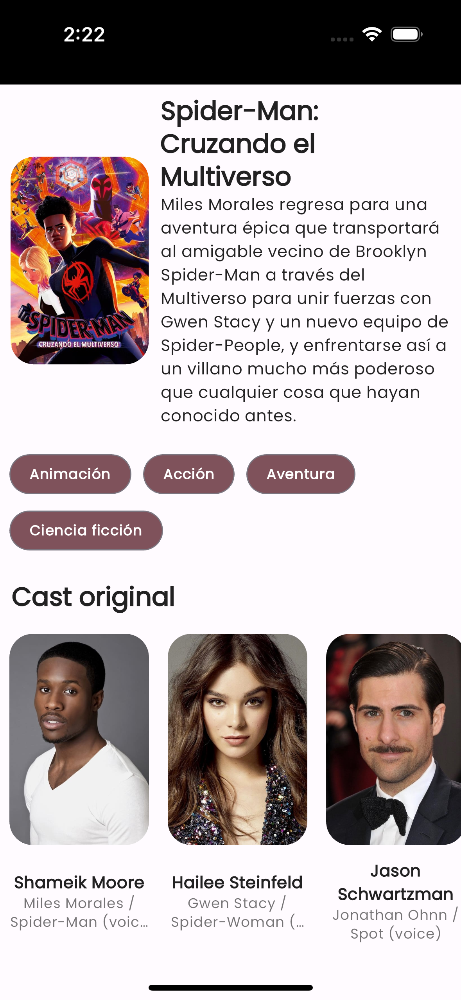

# CinemaSage

<!--  -->

CinemaSage is a movie application built using Flutter that allows you to explore and discover a vast collection of movies. It follows the clean architecture principles to ensure modularity, maintainability, and scalability. The app leverages the free API provided by TheMovieDB to fetch movie and TV show information, providing you with an enhanced cinematic experience.

## Features

- Browse a wide range of movies.
- Search for your favorite movies.
- View detailed information about movies.
- Create and manage your watchlist.
- Rate and review movies.
- ...and more!

## Screenshots

## Getting Started

Follow these steps to get started with CinemaSage:

1. Clone this repository: `https://github.com/astabaresg/cinemasage.git`
2. Navigate to the project directory: `cd cinemasage`
3. Install dependencies: `flutter pub get`
4. Create a free account on [TheMovieDB](https://www.themoviedb.org/) and obtain an API key.
5. Rename the file `.env.example` to `.env` and replace `"YOUR_API_KEY"` with your actual API key.
6. Run the app: `flutter run`

## Architecture

CinemaSage is built using the Clean Architecture approach, separating the app into different layers:

- Presentation: Handles UI, widgets, and user interactions.
- Domain: Contains the business logic, entities, and use cases.
- Data: Manages data sources, repositories, and API calls.

This architecture promotes maintainability, testability, and scalability, making it easier to add new features and make changes.

## Acknowledgments

CinemaSage uses the free API provided by [TheMovieDB](https://www.themoviedb.org/) to fetch movie and TV show data. We appreciate their support and contributions to the developer community.

## Contributing

Contributions are welcome! If you find a bug or have a feature request, please open an issue. Feel free to submit pull requests to help improve CinemaSage.

## License

This project is licensed under the MIT License - see the [LICENSE](LICENSE) file for details.
